# Real-World Architecture Mapping: ADVISOR MODELS in Production

Source paper: *How to Train Your Advisor: Steering Black-Box LLMs with ADVISOR MODELS* :contentReference[oaicite:0]{index=0}

## 1. Executive mapping

In production terms, the paper’s idea maps to this:

- Your **frontier LLM** stays a hosted API service
- You introduce a **small trainable advisor service**
- The advisor generates **task-specific steering instructions**
- Those instructions are injected into the frontier model call
- A **reward/evaluation layer** scores outcomes
- That score is used offline or asynchronously to improve the advisor

So instead of fine-tuning the expensive closed model, you build a **control plane around it**.

---

## 2. Production mental model

### Paper terms → real system terms

| Paper term | Real-world architecture equivalent |
|---|---|
| Advisor model | Small internal inference service |
| Student / black-box model | External LLM API provider |
| Advice | Dynamic system/developer augmentation or hidden context |
| Reward | Eval score, KPI, user signal, business outcome |
| RL training | Advisor improvement loop |
| Transfer | Reusing advisor across multiple LLM vendors/models |

---

## 3. End-to-end production architecture

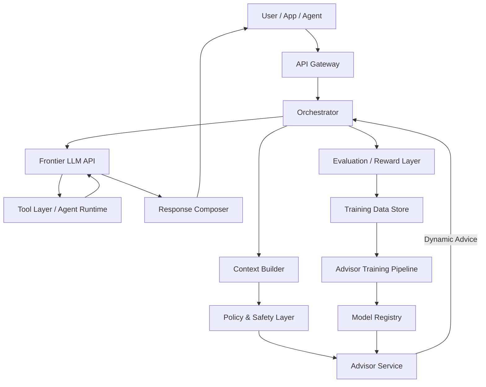

### What each block does

#### API Gateway
Handles auth, quotas, routing, tenancy, observability headers.

#### Orchestrator
Central runtime that decides:
- whether to call advisor
- which advisor version to use
- whether this is one-shot or multi-turn
- what data is safe to expose to advisor and LLM

#### Context Builder
Builds:
- user prompt
- retrieved docs
- task metadata
- session state
- persona / preferences / business policies

#### Policy & Safety Layer
Applies:
- PII filtering
- compliance
- redaction
- tenant policy
- prompt hardening
- jailbreak defenses

#### Advisor Service
Small, fast, cheap model that generates hidden steering text such as:
- “Be concise; user prefers implementation detail over theory”
- “Use grep first, avoid recursive ls”
- “Prefer Quebec French legal vocabulary”
- “Focus on refund eligibility before deductions”

#### Frontier LLM API
The expensive model you do not control:
- GPT-5
- Claude
- Gemini
- etc.

#### Tool Layer / Agent Runtime
Optional agent loop:
- search
- code exec
- DB access
- workflow actions
- browser/tool use

#### Evaluation / Reward Layer
Computes outcome score from:
- exact match
- rubric judge
- user acceptance
- task completion
- latency/cost
- conversion/support deflection/etc.

#### Training Pipeline
Improves the advisor from collected traces and rewards.

---

## 4. Runtime architecture: one-shot use case

Example: compliance Q&A, support answer generation, tax guidance, enterprise drafting.

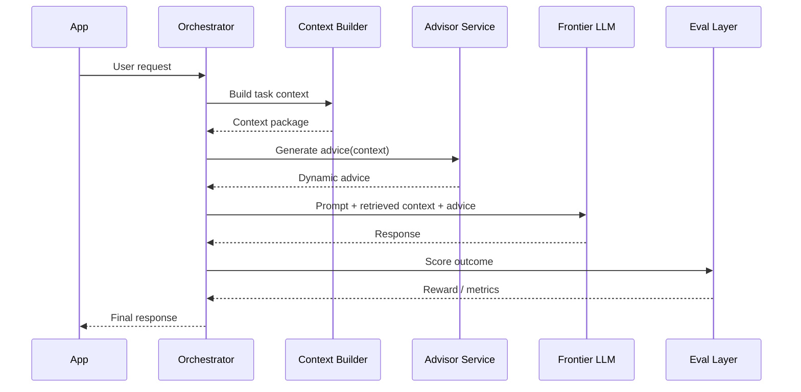

### Real injected prompt shape

The advice is usually hidden, not user-visible.

````text
System:
You are an enterprise tax assistant.

Hidden advisor guidance:
- Double-check filing status assumptions.
- Prioritize rules explicitly stated in supplied instructions.
- If ambiguity remains, surface it instead of guessing.
- Show calculation steps only when confidence is high.

User:
[actual user request]
````

---

## 5. Runtime architecture: agentic / multi-turn use case

Example: SWE agent, customer support workflow agent, research agent, sales ops agent.

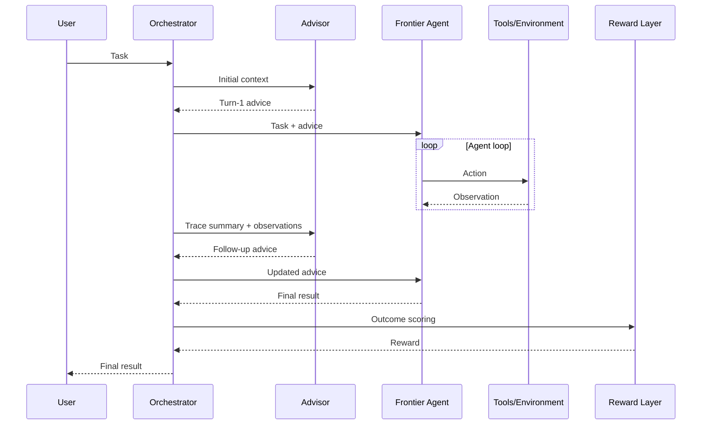

### Production interpretation

The advisor becomes a **supervisor policy** for the agent:
- reduce wasted steps
- suggest search strategies
- bias tool choice
- nudge toward termination
- prevent loops and overthinking

This directly matches the paper’s SWE efficiency setup on pages 3, 5, 13, and 16, where advisor guidance improves action efficiency while preserving solve rate. :contentReference[oaicite:1]{index=1} :contentReference[oaicite:2]{index=2} :contentReference[oaicite:3]{index=3} :contentReference[oaicite:4]{index=4}

---

## 6. Data architecture

You need three main data planes.

### A. Online serving data
Used during inference:
- request payload
- user profile / tenant profile
- retrieved knowledge
- recent conversation
- policy metadata
- advisor version
- LLM version

### B. Trace data
Collected after execution:
- prompts
- hidden advice
- tool traces
- outputs
- token usage
- latency
- cost
- safety events
- user actions

### C. Reward / label data
Used to train advisor:
- pass/fail
- correctness
- user thumbs up/down
- downstream KPI
- rubric score
- exact match
- judge model score
- business metric outcome

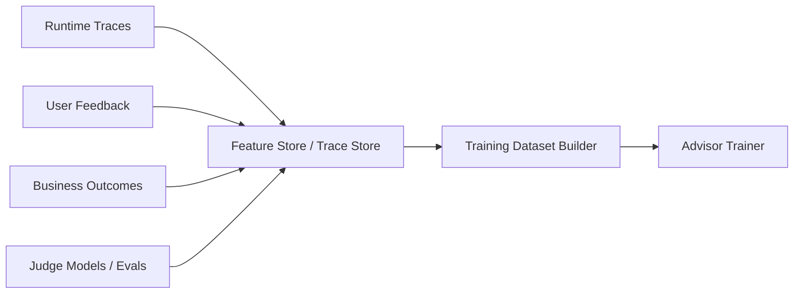

---

## 7. Control-plane architecture

This is the most useful real-world framing.

### The frontier model is the data plane
It produces the final content/action.

### The advisor is the control plane
It shapes behavior without modifying the underlying engine.

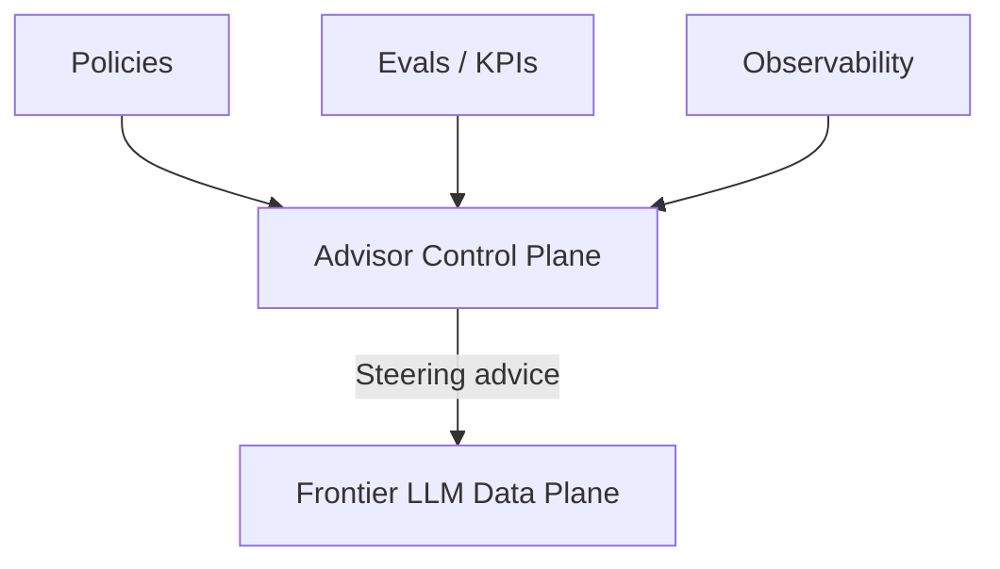

This is why the pattern is operationally attractive:
- no fine-tune dependency on vendor
- swap models underneath
- preserve portability
- centralize optimization

This aligns with the paper’s transferability claim: advisors trained with cheaper or different students still improve frontier models, sometimes even across providers. :contentReference[oaicite:5]{index=5} :contentReference[oaicite:6]{index=6} :contentReference[oaicite:7]{index=7}

---

## 8. Deployment topology

## Option 1: Embedded advisor inside orchestrator
Best for:
- simpler stacks
- lower latency
- one team owns everything

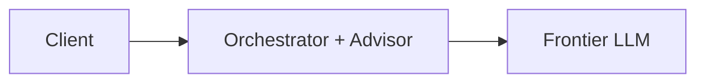

### Pros
- simple
- fewer hops
- easier rollout

### Cons
- tightly coupled
- harder to reuse across domains

---

## Option 2: Advisor as separate microservice
Best for:
- multiple apps
- multiple business units
- centralized governance

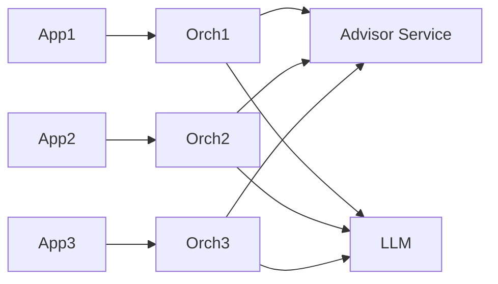

### Pros
- reusable
- versionable
- better experimentation

### Cons
- extra network hop
- more infra complexity

---

## 9. Model-routing architecture

A practical extension: use the advisor to route across models too.

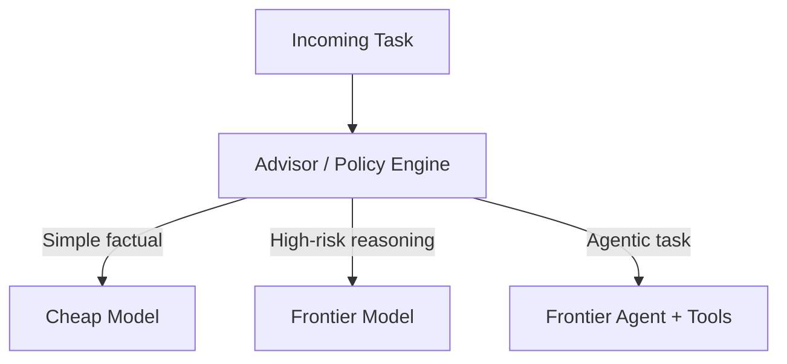

In practice the advisor can emit:
- prompt steering
- model selection hint
- tool-use policy
- verbosity target
- confidence threshold
- escalation recommendation

This is not the paper’s exact setup, but it is the most natural production generalization.

---

## 10. Training architecture in the real world

The paper uses RL-style optimization on advisor outputs rather than tuning the closed model itself. :contentReference[oaicite:8]{index=8}

### Production training loop

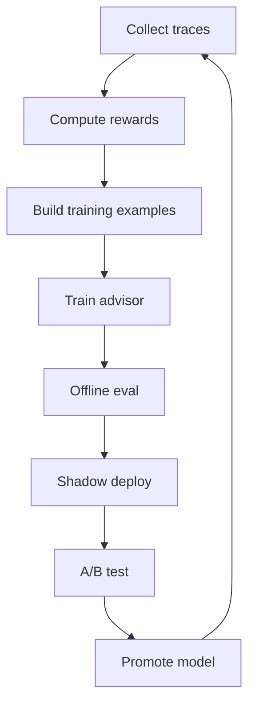

### Reward sources by domain

| Domain | Reward signal |
|---|---|
| Tax / compliance | exact answer, rule adherence, audit rubric |
| Support | ticket resolution, CSAT, deflection |
| Coding agent | resolved issue, fewer steps, fewer retries |
| Sales | booked meeting, CRM progression |
| Personalization | clickthrough, dwell time, user preference match |
| Writing | human rubric, revision acceptance rate |

---

## 11. A concrete SaaS example: enterprise support copilot

### Goal
Improve support quality for a black-box LLM without vendor fine-tuning.

### Architecture

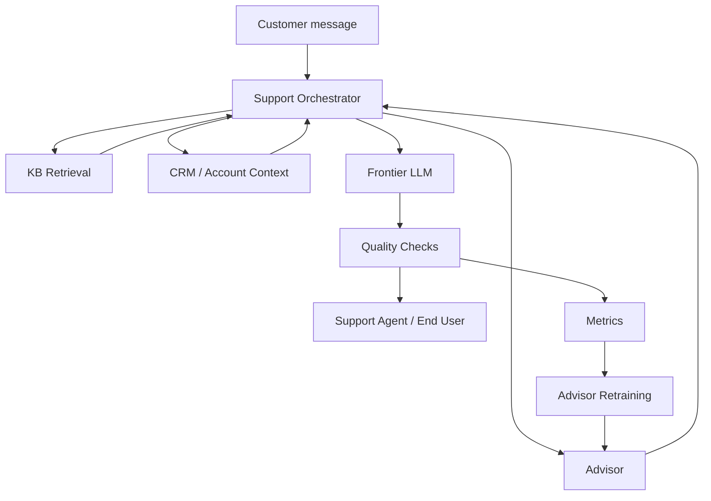

### Advisor examples
- “Enterprise account; avoid speculative language.”
- “Customer is frustrated; acknowledge issue before solution.”
- “Prioritize steps that do not require admin privileges.”
- “Mention SLA boundaries explicitly.”
- “Use existing incident wording because outage is active.”

### Reward examples
- ticket reopened?
- resolution time
- macro acceptance
- CSAT
- escalation rate
- hallucination flags

---

## 12. A concrete engineering example: repo-aware coding agent

This is the closest real-world mapping to the paper’s SWE agent setup.

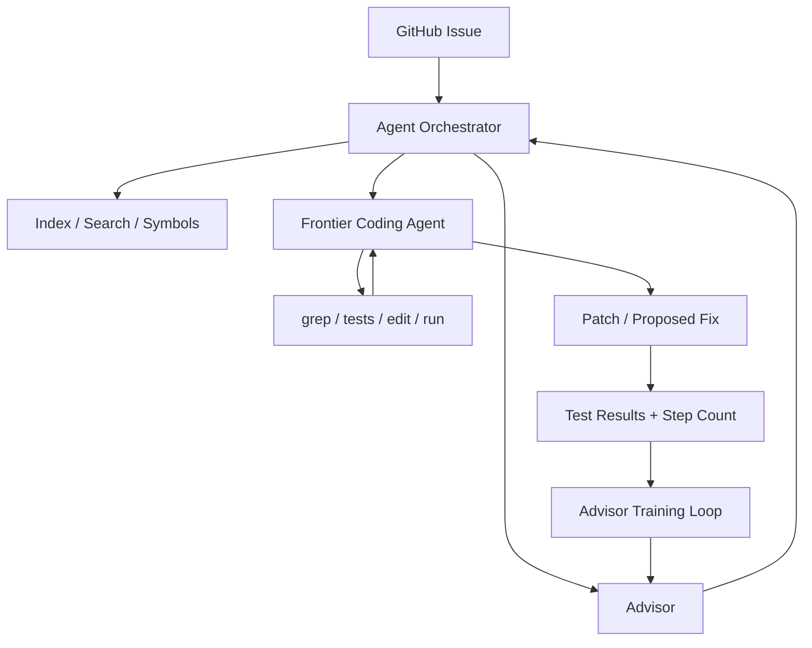

### Advisor behaviors that matter
- suggest first investigation action
- discourage broad file listing
- tell agent to search symbol references first
- recommend when to run tests
- encourage minimal patch strategy
- prevent premature edits

That matches the paper’s qualitative example where trained advice becomes more concrete and operational, like using `grep` immediately rather than vague instructions. :contentReference[oaicite:9]{index=9}

---

## 13. Personalization architecture

The paper shows this is especially strong when preferences are hidden and per-user. :contentReference[oaicite:10]{index=10}

### Real-world mapping

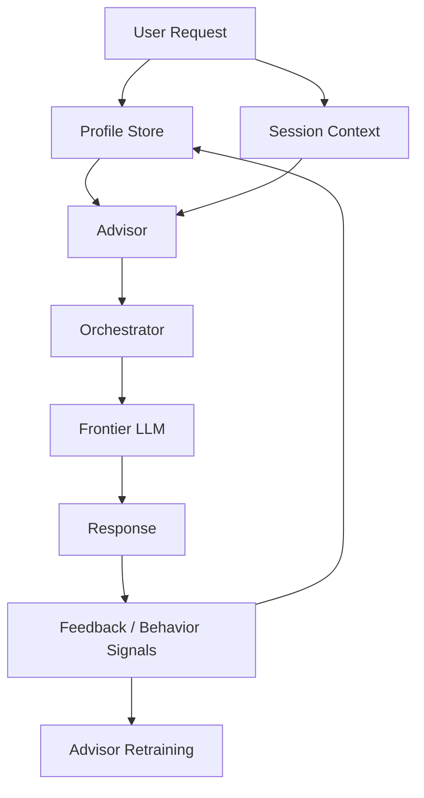

### Profile store may contain
- verbosity preference
- reading level
- tone
- jurisdiction
- output structure preference
- decision style
- known constraints
- domain familiarity

### Advisor may generate
- “User prefers terse operational guidance”
- “Avoid educational exposition”
- “Use bullet hierarchy and decision framing”
- “Present tradeoffs before recommendation”

### Important production nuance
Do not stuff the entire user profile into the prompt every time.  
Instead, let the advisor compress relevant preferences into **instance-specific steering**. That is one of the main practical advantages over static profile prompting.

---

## 14. Safety and governance architecture

Because the advisor can steer behavior, it becomes a governed component.

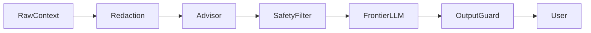

### Guardrails you want
- redact secrets before advisor training
- block advisor from inserting unsafe tactics
- version advice templates
- log hidden advice for audit
- attach policy hash to every response
- support replayability

### Key governance question
Should advisor text be stored verbatim?

Usually:
- yes in secure trace storage
- no in end-user transcript
- maybe hashed or partially redacted in regulated environments

---

## 15. Observability architecture

Without strong observability, this pattern becomes impossible to trust.

### Log at minimum
- request ID
- tenant/user segment
- advisor version
- frontier model version
- advice text
- prompt tokens
- completion tokens
- latency
- tool calls
- reward score
- human override / user feedback

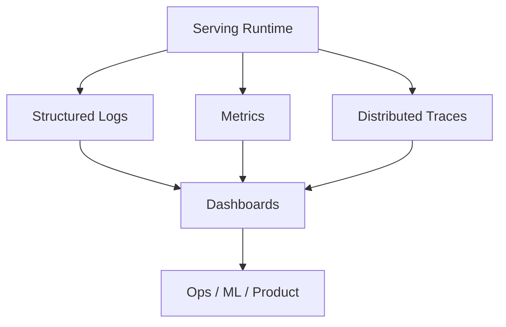

### Metrics to watch
- answer quality
- reward by segment
- latency added by advisor
- token overhead from advice
- regression on unrelated tasks
- model drift after provider model updates

The paper explicitly highlights robustness and lack of degradation on unrelated tasks as a key benefit, so you should test for that in production too. :contentReference[oaicite:11]{index=11} :contentReference[oaicite:12]{index=12}

---

## 16. Rollout strategy

Do not deploy this as all-or-nothing.

### Recommended path


### Stage details

#### Offline evals
Use historical traces and benchmark tasks.

#### Shadow mode
Generate advice but do not affect user output yet.

#### Limited A/B
Small percentage of traffic.

#### Segmented rollout
Enable only for:
- complex tasks
- high-value accounts
- specific domains

#### Full rollout
After proving:
- quality lift
- acceptable latency
- acceptable token cost
- no safety regressions

---

## 17. Cost architecture

The whole point is economic leverage.

### Cost pattern
- advisor model: cheap, frequent
- frontier model: expensive, final authority
- training: mostly on cheaper pathways
- transfer gains to expensive models later

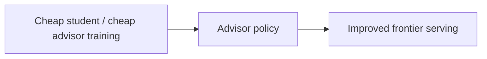

This is directly consistent with the paper’s argument that training advisors with lower-cost students can still improve frontier models at much lower overall cost. :contentReference[oaicite:13]{index=13} :contentReference[oaicite:14]{index=14}

### Budget knobs
- call advisor only on hard tasks
- summarize state before advisor calls
- restrict advice length
- lower advisor frequency in agent loops
- distill domain-specific advisors
- separate offline training from online serving

---

## 18. Failure modes in real systems

### 1. Advice overfits one model vendor
Fix:
- multi-model eval matrix
- train for portability where possible

### 2. Advice becomes too verbose
Fix:
- hard token budgets
- reward efficiency

### 3. Advisor conflicts with system policy
Fix:
- policy precedence rules
- advice validation layer

### 4. Good offline reward, bad UX
Fix:
- include user behavior and human review in reward

### 5. No measurable benefit in saturated domains
Fix:
- use advisor selectively only where there is headroom

That last point is in the paper’s limits section: if the model already knows the domain extremely well, the advisor may have little or nothing to add. :contentReference[oaicite:15]{index=15}

---

## 19. Recommended architecture patterns by maturity

### Early stage
- single orchestrator
- single advisor service
- offline eval only
- simple rewards
- one domain

### Growth stage
- domain-specific advisors
- centralized trace store
- A/B experimentation
- reward aggregation from product metrics

### Mature platform
- advisor registry
- policy composition
- tenant-specific variants
- model routing + advice
- safety-reviewed promotion workflow
- continuous evaluation against provider drift

---

## 20. Reference architecture blueprint

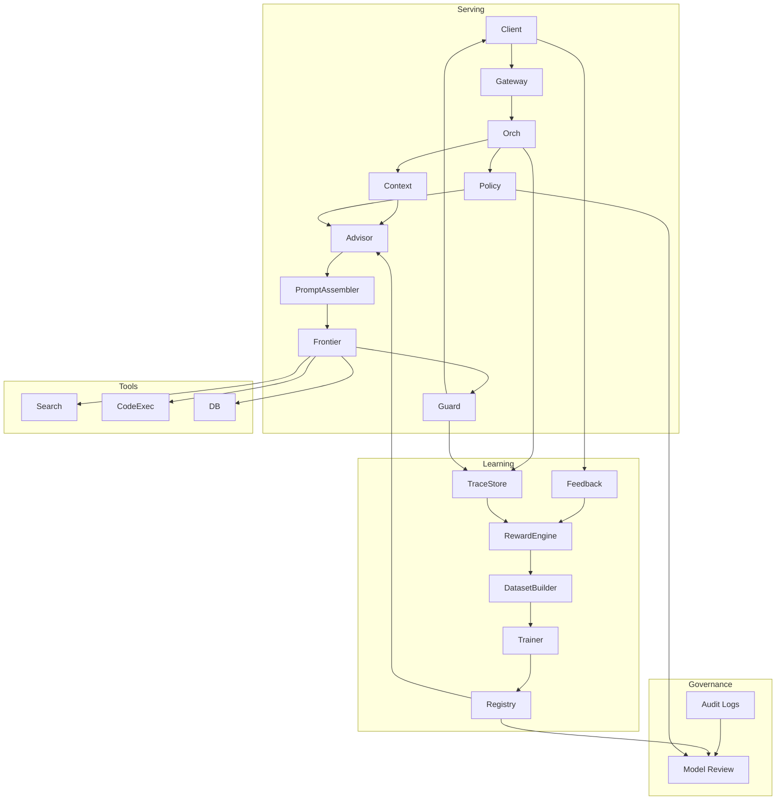

---

## 21. Best practical interpretation

If I had to reduce the paper to one architecture statement:

> Build a small learned orchestration layer that emits hidden, per-request control instructions for a closed LLM, then optimize that layer against real outcomes.

That is the real-world architecture.

---

## 22. Where this is most worth implementing

Highest ROI domains:
- compliance and policy-heavy reasoning
- support copilots
- coding agents
- workflow agents
- personalization-heavy products
- multilingual or niche-domain assistants

Lower ROI domains:
- already-saturated generic tasks
- low-value one-shot chat
- domains with weak reward signals

---

## 23. Practical build order

1. Start with one domain and one clear reward.
2. Log hidden advice separately from user-visible output.
3. Keep advisor outputs short and structured.
4. Run shadow mode before any live steering.
5. Use offline evals on unrelated tasks to detect regressions.
6. Treat the advisor as a versioned policy artifact, not just a prompt helper.

---

## 24. Bottom line

This paper maps in production to a **learned LLM orchestration/control layer**:

- **Orchestrator** decides
- **Advisor** steers
- **Frontier model** executes
- **Eval layer** scores
- **Training loop** improves the advisor
- **Governance layer** keeps it safe and auditable

It is not replacing your LLM stack.  
It is the layer that makes a black-box LLM stack tunable without needing model weights.

If you want, next I can turn this into a concrete AWS/GCP/Azure deployment diagram with services, queues, stores, and model endpoints.