# 📄 Full Summary: *How to Train Your Advisor – Steering Black-Box LLMs with ADVISOR MODELS*  
Source: :contentReference[oaicite:0]{index=0}

---

# 🧠 1. Core Idea

**Problem:**  
You can’t fine-tune frontier LLMs (GPT-5, Claude, Gemini) because they are **black-box APIs**.  
Static prompting is weak because it:
- Doesn’t adapt per input
- Hits context limits
- Fails at personalization & specialization

**Solution:**  
➡️ Train a **separate small model (“Advisor”)** that generates **dynamic, per-instance advice** to steer the black-box model.

---

# ⚙️ 2. High-Level Architecture

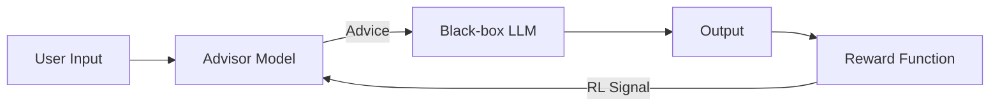

### Key Concept
- Advisor = **policy**
- Advice = **action**
- Output quality = **reward**
- Training = **Reinforcement Learning**

📌 The black-box model is NEVER modified.

---

# 🔁 3. Core Process (2-Step vs 3-Step)

## 3.1 Standard (2-Step)

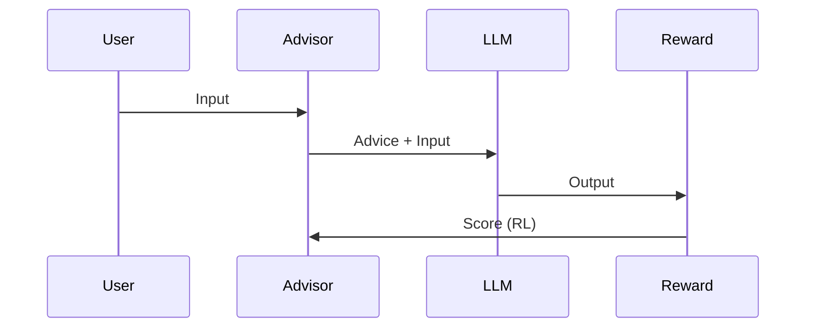

---

## 3.2 Improved (3-Step Variant)

Used for complex reasoning.

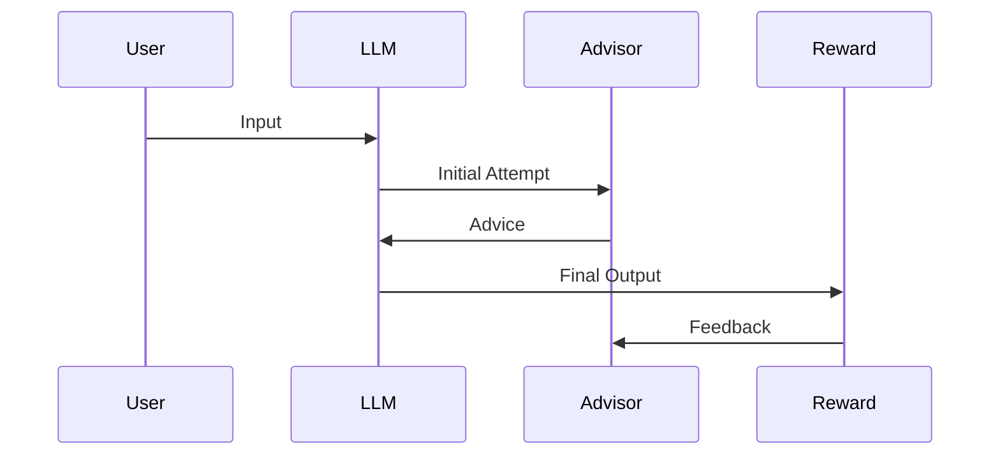

📌 Insight: Advisor becomes a **critic/verifier**, not just generator.

---

# 🔄 4. Multi-Turn / Agent Setting

For tasks like SWE agents:

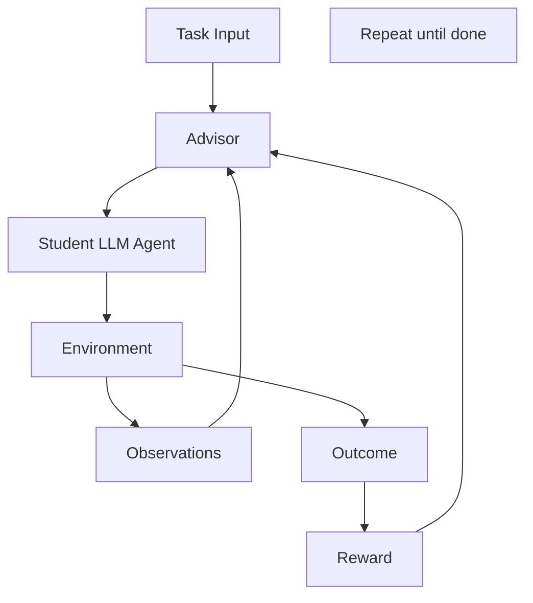

📌 Advisor:
- Injects guidance at intervals
- Improves efficiency (not just correctness)

---

# 🏋️ 5. Training Mechanism

- Uses **Reinforcement Learning (GRPO)**  
- No gradients from LLM needed  
- Reward comes from:
  - Accuracy
  - Efficiency
  - Preference satisfaction

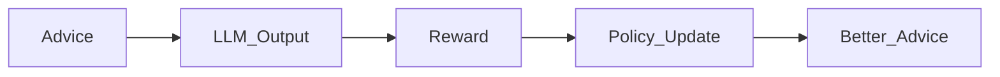

---

# 🚀 6. Key Capabilities

## 6.1 Specialized Reasoning
- +71% improvement in tax reasoning (GPT-5) :contentReference[oaicite:1]{index=1}  
- +24.6% efficiency in SWE agents :contentReference[oaicite:2]{index=2}  

## 6.2 Personalization
- Learns **hidden user preferences**
- Achieves **~85–100% vs 40–60% baseline** :contentReference[oaicite:3]{index=3}  

## 6.3 Transferability
- Train on cheap model → apply to GPT-5
- Works across model families (GPT → Claude)

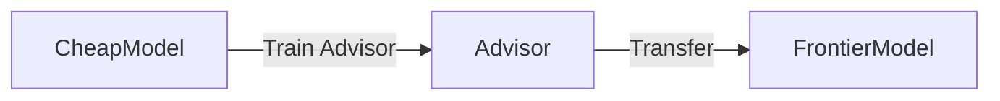

---

# 🧩 7. Why It Works

### Static Prompting
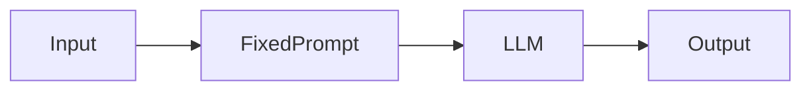

### Advisor Models
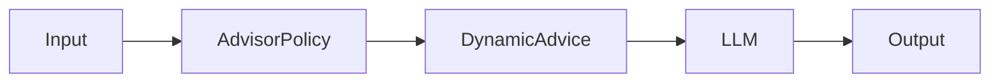

📌 Shift:
- From **searching prompts**
- To **learning a policy**

---

# 📊 8. Empirical Insights

## 8.1 Before vs After Training
- Untrained advisor = often harmful
- Trained advisor = significant gains

## 8.2 Efficiency Tradeoff (SWE example)
- Before: faster but worse accuracy
- After: faster AND same accuracy

## 8.3 Personalization
- Outperforms:
  - GEPA
  - Profile-Augmented Generation
  - Even “oracle prompts” (full info)

---

# 🔬 9. Key Properties

## 9.1 Transferability
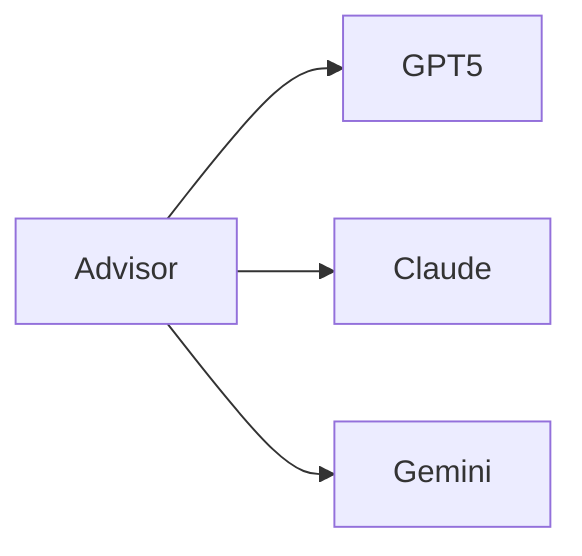

## 9.2 Robustness
- No catastrophic forgetting
- Core model untouched

## 9.3 Interpretability
- Advice is human-readable
- Can inspect evolution of reasoning

---

# ⚖️ 10. Comparison to Alternatives

| Method | Limitation | Advisor Advantage |
|------|--------|----------------|
| Static prompts | One-size-fits-all | Per-instance |
| Prompt optimization | Still static | Dynamic |
| Fine-tuning | Requires weights | Works with black-box |
| RL on model | Expensive/impossible | Externalized RL |

---

# ⚠️ 11. Limitations

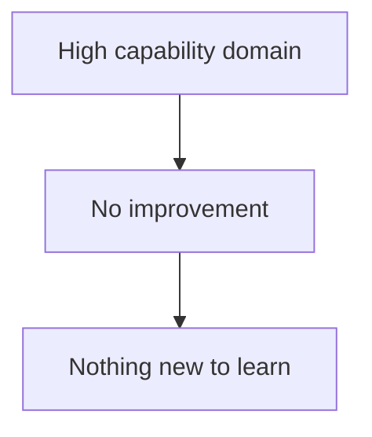

- If model already “maxed out” → no gains
- Adds latency (extra model)
- RL cost still exists (but cheaper than fine-tuning)

---

# 🧪 12. When It Works Best

✅ Strong gains when:
- Domain knowledge is missing
- Preferences are hidden
- Tasks are multi-step / agentic

❌ Weak gains when:
- Model already saturated (e.g., math benchmarks)

---

# 🧠 13. Conceptual Reframe

### Traditional View
> Prompt engineering = manual tweaking

### Advisor Models View
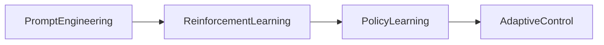

➡️ Prompting becomes **policy optimization**

---

# 🧭 14. Big Picture

This paper introduces a **new paradigm**:

> “Parametric optimization *around* black-box models instead of *inside* them.”

---

# 🧩 15. Mental Model

Think of it as:

- LLM = **engine**
- Advisor = **driver**
- RL = **learning how to drive better**

---

# 🏁 Final Takeaways

- You can **optimize black-box LLMs without touching them**
- Dynamic advice > static prompts
- Small models can **control larger ones**
- This is essentially:
  
> 🔥 *“RL wrapper around LLM APIs”*

---

If you want, I can:
- Map this to real-world architecture (prod system)
- Compare it to RAG / agents / tool use
- Or design a concrete implementation for your stack